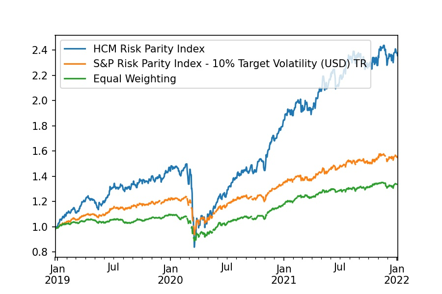

Portfolio replication of S&P Risk Parity.
The replciated curve looks very similar to the actual
S&P Risk Parity Index.

# Comparison Graph


# Correlation table
|                                 | HCM Risk Parity Index | S&P Risk Parity Index | Equal Weighting |
|:--------------------------------|----------------------:|----------------------:|----------------:|
| HCM Risk Parity Index           |                     1 |                  0.94 |            0.88 |
| S&P Risk Parity Index           |                  0.94 |                     1 |            0.85 |
| Equal Weighting                 |                  0.88 |                  0.85 |               1 |
|                            
# Performance Metrics
### Monthly Rebalancing

```plaintext
Start                        2012-01-02 00:00:00
End                          2022-01-03 00:00:00
Duration                      3654 days 00:00:00
Return (Ann.) [%]                      13.155015
Volatility (Ann.) [%]                  12.505835
Information Ratio                        1.05191
Final AUM [unitless]                    3.635543
AUM Peak [$]                            3.652543
Final Return [%]                      263.554264
Max. Drawdown [%]                      -21.75385
Max. Drawdown Duration         488 days 00:00:00
Avg. Drawdown Duration         143 days 21:20:00
Max. Underwater Duration       464 days 00:00:00
Total Underwater Duration     2603 days 00:00:00
```


### Daily Rebalancing
```plaintext
Start                        2011-12-26 00:00:00
End                          2022-01-03 00:00:00
Duration                      3661 days 00:00:00
Return (Ann.) [%]                      13.286219
Volatility (Ann.) [%]                  12.415014
Information Ratio                       1.070173
Final AUM [unitless]                    3.689003
AUM Peak [$]                            3.706223
Final Return [%]                      263.840078
Max. Drawdown [%]                     -21.559265
Max. Drawdown Duration         488 days 00:00:00
Avg. Drawdown Duration         143 days 21:20:00
Max. Underwater Duration       464 days 00:00:00
Total Underwater Duration     2606 days 00:00:00
```

### Weekly Rebalancing

#### Monday
```plaintext
Start                        2012-01-02 00:00:00
End                          2022-01-03 00:00:00
Duration                      3654 days 00:00:00
Return (Ann.) [%]                      13.153161
Volatility (Ann.) [%]                  12.443584
Information Ratio                       1.057023
Final AUM [unitless]                     3.63492
AUM Peak [$]                            3.651888
Final Return [%]                      263.492044
Max. Drawdown [%]                     -21.578937
Max. Drawdown Duration         488 days 00:00:00
Avg. Drawdown Duration         143 days 21:20:00
Max. Underwater Duration       464 days 00:00:00
Total Underwater Duration     2603 days 00:00:00
```

#### Tuesday
```plaintext
Start                        2012-01-03 00:00:00
End                          2022-01-03 00:00:00
Duration                      3653 days 00:00:00
Return (Ann.) [%]                      13.124885
Volatility (Ann.) [%]                  12.454651
Information Ratio                       1.053814
Final AUM [unitless]                    3.623657
AUM Peak [$]                            3.640601
Final Return [%]                      262.365694
Max. Drawdown [%]                      -21.85667
Max. Drawdown Duration         488 days 00:00:00
Avg. Drawdown Duration         143 days 21:20:00
Max. Underwater Duration       464 days 00:00:00
Total Underwater Duration     2603 days 00:00:00
```

#### Wednesday
```plaintext
Start                        2012-01-04 00:00:00
End                          2022-01-03 00:00:00
Duration                      3652 days 00:00:00
Return (Ann.) [%]                      13.006569
Volatility (Ann.) [%]                  12.452216
Information Ratio                       1.044518
Final AUM [unitless]                    3.582532
AUM Peak [$]                            3.599283
Final Return [%]                      258.253232
Max. Drawdown [%]                     -21.732728
Max. Drawdown Duration         488 days 00:00:00
Avg. Drawdown Duration         143 days 21:20:00
Max. Underwater Duration       464 days 00:00:00
Total Underwater Duration     2599 days 00:00:00
```

#### Thursday
```plaintext
Start                        2012-01-05 00:00:00
End                          2022-01-03 00:00:00
Duration                      3651 days 00:00:00
Return (Ann.) [%]                      13.047936
Volatility (Ann.) [%]                  12.449193
Information Ratio                       1.048095
Final AUM [unitless]                    3.594478
AUM Peak [$]                            3.611288
Final Return [%]                      259.447796
Max. Drawdown [%]                      -21.69315
Max. Drawdown Duration         488 days 00:00:00
Avg. Drawdown Duration         143 days 21:20:00
Max. Underwater Duration       464 days 00:00:00
Total Underwater Duration     2598 days 00:00:00
```

#### Friday
```plaintext
Start                        2011-12-30 00:00:00
End                          2022-01-03 00:00:00
Duration                      3657 days 00:00:00
Return (Ann.) [%]                      13.199051
Volatility (Ann.) [%]                  12.459574
Information Ratio                        1.05935
Final AUM [unitless]                    3.652157
AUM Peak [$]                            3.669235
Final Return [%]                      262.808968
Max. Drawdown [%]                     -21.789322
Max. Drawdown Duration         488 days 00:00:00
Avg. Drawdown Duration         143 days 21:20:00
Max. Underwater Duration       464 days 00:00:00
Total Underwater Duration     2604 days 00:00:00
```
