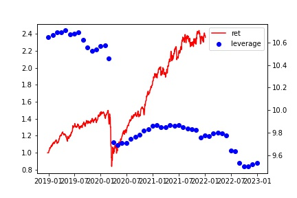
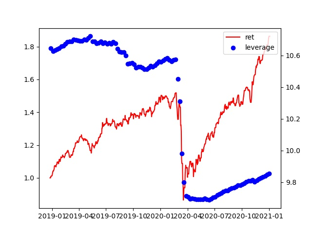

Portfolio replication of S&P Risk Parity.
The replciated curve looks very similar to the actual
S&P Risk Parity Index.

# Comparison Graph


# Correlation table
|                                 | HCM Risk Parity Index | S&P Risk Parity Index | Equal Weighting |
|:--------------------------------|----------------------:|----------------------:|----------------:|
| HCM Risk Parity Index           |                     1 |                  0.95 |             0.9 |
| S&P Risk Parity Index           |                  0.95 |                     1 |            0.88 |
| Equal Weighting                 |                   0.9 |                  0.88 |               1 |
|                            
# Performance Metrics
### Monthly Rebalancing

```plaintext
Start                        2012-01-02 00:00:00
End                          2022-01-03 00:00:00
Duration                      3654 days 00:00:00
Return (Ann.) [%]                      11.346089
Volatility (Ann.) [%]                  12.640215
Information Ratio                       0.897618
Final AUM [unitless]                    3.065772
AUM Peak [$]                             3.08359
Final Return [%]                      206.577202
Max. Drawdown [%]                     -20.978841
Max. Drawdown Duration         427 days 00:00:00
Avg. Drawdown Duration         146 days 00:00:00
Max. Underwater Duration       463 days 00:00:00
Total Underwater Duration     2598 days 00:00:00
```


### Daily Rebalancing
```plaintext
Start                        2011-12-26 00:00:00
End                          2020-12-31 00:00:00
Duration                      3293 days 00:00:00
Return (Ann.) [%]                      10.333664
Volatility (Ann.) [%]                  12.473446
Information Ratio                       0.828453
Final AUM [unitless]                    2.520319
AUM Peak [$]                            2.520319
Final Return [%]                      148.514576
Max. Drawdown [%]                     -20.779154
Max. Drawdown Duration         427 days 00:00:00
Avg. Drawdown Duration         149 days 01:20:00
Max. Underwater Duration       202 days 00:00:00
Total Underwater Duration     2341 days 00:00:00
```

### Weekly Rebalancing

#### Monday
```plaintext
Start                        2011-12-26 00:00:00
End                          2020-12-31 00:00:00
Duration                      3293 days 00:00:00
Return (Ann.) [%]                      10.324994
Volatility (Ann.) [%]                  12.498489
Information Ratio                       0.826099
Final AUM [unitless]                    2.518458
AUM Peak [$]                            2.518458
Final Return [%]                      148.333126
Max. Drawdown [%]                     -20.799757
Max. Drawdown Duration         427 days 00:00:00
Avg. Drawdown Duration         149 days 01:20:00
Max. Underwater Duration       202 days 00:00:00
Total Underwater Duration     2341 days 00:00:00
```

#### Tuesday
```plaintext
Start                        2011-12-27 00:00:00
End                          2020-12-31 00:00:00
Duration                      3292 days 00:00:00
Return (Ann.) [%]                      10.303405
Volatility (Ann.) [%]                    12.5073
Information Ratio                       0.823791
Final AUM [unitless]                    2.512844
AUM Peak [$]                            2.512844
Final Return [%]                      147.885631
Max. Drawdown [%]                     -21.061776
Max. Drawdown Duration         427 days 00:00:00
Avg. Drawdown Duration         147 days 08:00:00
Max. Underwater Duration       202 days 00:00:00
Total Underwater Duration     2341 days 00:00:00
```

#### Wednesday
```plaintext
Start                        2011-12-28 00:00:00
End                          2020-12-31 00:00:00
Duration                      3291 days 00:00:00
Return (Ann.) [%]                      10.238696
Volatility (Ann.) [%]                  12.509954
Information Ratio                       0.818444
Final AUM [unitless]                    2.498052
AUM Peak [$]                            2.498052
Final Return [%]                      148.007361
Max. Drawdown [%]                     -20.926296
Max. Drawdown Duration         427 days 00:00:00
Avg. Drawdown Duration         147 days 08:00:00
Max. Underwater Duration       202 days 00:00:00
Total Underwater Duration     2338 days 00:00:00
```

#### Thursday
```plaintext
Start                        2011-12-29 00:00:00
End                          2020-12-31 00:00:00
Duration                      3290 days 00:00:00
Return (Ann.) [%]                      10.299372
Volatility (Ann.) [%]                  12.507389
Information Ratio                       0.823463
Final AUM [unitless]                    2.510011
AUM Peak [$]                            2.510011
Final Return [%]                      148.154999
Max. Drawdown [%]                     -20.899256
Max. Drawdown Duration         427 days 00:00:00
Avg. Drawdown Duration         147 days 08:00:00
Max. Underwater Duration       202 days 00:00:00
Total Underwater Duration     2338 days 00:00:00
```

#### Friday
```plaintext
Start                        2011-12-30 00:00:00
End                          2020-12-31 00:00:00
Duration                      3289 days 00:00:00
Return (Ann.) [%]                      10.237328
Volatility (Ann.) [%]                  12.521364
Information Ratio                       0.817589
Final AUM [unitless]                    2.495815
AUM Peak [$]                            2.495815
Final Return [%]                      147.991486
Max. Drawdown [%]                     -20.980809
Max. Drawdown Duration         427 days 00:00:00
Avg. Drawdown Duration         147 days 08:00:00
Max. Underwater Duration       202 days 00:00:00
Total Underwater Duration     2338 days 00:00:00
```